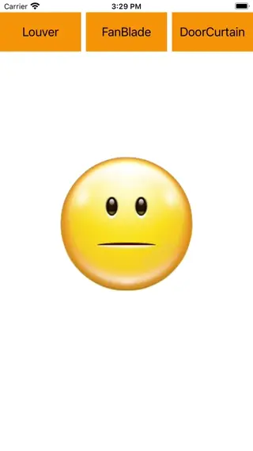

# WWMotionGraphicTransition

[](https://developer.apple.com/swift/) [](https://developer.apple.com/swift/)  [](https://developer.apple.com/swift/) [](https://developer.apple.com/swift/)

### [Introduction - 簡介](https://swiftpackageindex.com/William-Weng)
- [Imitate the polygonal transition animation commonly used in movies.](https://youtu.be/jlR2J_Ztl4Y)
- [模仿影片常用的多邊形轉場動畫。](https://tw.cyberlink.com/blog/the-top-video-editors/982/motion-graphics)



### [Installation with Swift Package Manager](https://medium.com/彼得潘的-swift-ios-app-開發問題解答集/使用-spm-安裝第三方套件-xcode-11-新功能-2c4ffcf85b4b)
```bash
dependencies: [
    .package(url: "https://github.com/William-Weng/WWMotionGraphicTransition.git", .upToNextMajor(from: "1.2.1"))
]
```

### [可用函式 - Function](https://ezgif.com/video-to-webp)
|函式|說明|
|-|-|
|build()|建立實體|
|start(count:colors:duration:direction:)|動畫開始|
|end(duration:direction:)|動畫結束|

### 可用效果 - Effect
|效果|說明|
|-|-|
|DoorCurtain|像單片門簾開關的過場動畫|
|FanBlade|像電風扇葉片旋轉的過場動畫|
|Louver|像百葉窗開合的過場動畫|

### Example
```swift
import UIKit
import WWMotionGraphicTransition

final class ViewController: UIViewController {

    @IBOutlet weak var widthConstraint: NSLayoutConstraint!
    @IBOutlet weak var demoView: UIView!
    @IBOutlet weak var faceImageView: UIImageView!
    
    private let duration: TimeInterval = 0.5
    private let colors: [UIColor] = [.red, .yellow, .blue, .green, .orange]

    private var count: Int { colors.count }
    private var doorCurtain: WWMotionGraphicTransition.DoorCurtain!
    private var fanBlade: WWMotionGraphicTransition.FanBlade!
    private var louver: WWMotionGraphicTransition.Louver!

    override func viewDidLoad() {
        super.viewDidLoad()
        initSetting()
    }
    
    @IBAction func doorCurtainEffect(_ sender: UIButton) {
        faceImageView.addSubview(doorCurtain)
        doorCurtain.start(count: count, colors: colors, duration: duration)
    }
    
    @IBAction func fanBladeEffect(_ sender: UIButton) {
        faceImageView.addSubview(fanBlade)
        fanBlade.start(count: count, colors: colors, duration: duration)
    }
    
    @IBAction func louverEffect(_ sender: UIButton) {
        faceImageView.addSubview(louver)
        louver.start(count: count, colors: colors, duration: duration)
    }
}

extension ViewController: WWMotionGraphicTransitionDelegate {
    
    func start(effectView: UIView, number: Int, status: WWMotionGraphicTransition.Status) {
        
        faceImageView.image = UIImage(named: "Face1")
                
        if (number < count) { return }
        if (status != .end) { return }
        
        faceImageView.image = UIImage(named: "Face2")
        
        if effectView is WWMotionGraphicTransition.DoorCurtain { doorCurtain.end(duration: duration); return }
        if effectView is WWMotionGraphicTransition.FanBlade { fanBlade.end(duration: duration); return }
        if effectView is WWMotionGraphicTransition.Louver { louver.end(duration: duration); return }
    }
    
    func end(effectView: UIView, number: Int, status: WWMotionGraphicTransition.Status) {
        
        if (number < colors.count) { return }
        if (status != .end) { return }
        
        if effectView is WWMotionGraphicTransition.DoorCurtain { doorCurtain.removeFromSuperview(); return }
        if effectView is WWMotionGraphicTransition.FanBlade { fanBlade.removeFromSuperview(); return}
        if effectView is WWMotionGraphicTransition.Louver { louver.removeFromSuperview(); return}
    }
}

private extension ViewController {
    
    func initSetting() {
        
        doorCurtain = WWMotionGraphicTransition.DoorCurtain.build(frame: faceImageView.bounds)
        doorCurtain.delegate = self

        fanBlade = WWMotionGraphicTransition.FanBlade.build(frame: faceImageView.bounds)
        fanBlade.delegate = self
        
        louver = WWMotionGraphicTransition.Louver(frame: faceImageView.bounds)
        louver.delegate = self
    }
}
```
