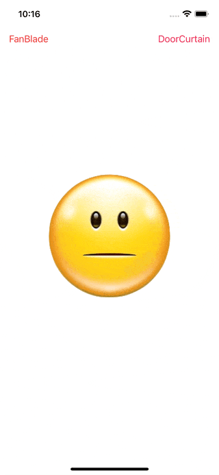

# WWMotionGraphicTransition

[](https://developer.apple.com/swift/) [](https://developer.apple.com/swift/)  [](https://developer.apple.com/swift/) [](https://developer.apple.com/swift/)

## [Introduction - 簡介](https://swiftpackageindex.com/William-Weng)
- [Imitate the polygonal transition animation commonly used in movies.](https://youtu.be/jlR2J_Ztl4Y)
- [模仿影片常用的多邊形轉場動畫。](https://tw.cyberlink.com/blog/the-top-video-editors/982/motion-graphics)



## [Installation with Swift Package Manager](https://medium.com/彼得潘的-swift-ios-app-開發問題解答集/使用-spm-安裝第三方套件-xcode-11-新功能-2c4ffcf85b4b)
```bash
dependencies: [
    .package(url: "https://github.com/William-Weng/WWMotionGraphicTransition.git", .upToNextMajor(from: "1.0.1"))
]
```

## 可用函式
|函式|說明|
|-|-|
|build()|建立實體|
|start(duration:direction:count:colors:)|動畫開始|
|end(duration:)|動畫結束|

## Example
```swift
import UIKit
import WWMotionGraphicTransition

final class ViewController: UIViewController {

    @IBOutlet weak var faceImageView: UIImageView!
    
    private let count = 5
    private let colors: [UIColor] = [.red, .yellow, .green, .blue, .orange]
    private let duration: TimeInterval = 0.5
    
    private var doorCurtain: WWMotionGraphicTransition.DoorCurtain!
    
    override func viewDidLoad() {
        super.viewDidLoad()
    }
    
    @IBAction func doorCurtainEffect(_ sender: UIBarButtonItem) {

        doorCurtain = WWMotionGraphicTransition.DoorCurtain.maker(frame: faceImageView.bounds)
        doorCurtain.delegate = self
        faceImageView.addSubview(doorCurtain)

        doorCurtain.start(duration: duration, count: count, colors: colors)
    }
}

extension ViewController: WWMotionGraphicTransitionDoorCurtainDelegate {
    
    func start(doorCurtain: WWMotionGraphicTransition.DoorCurtain, index: Int, status: WWMotionGraphicTransition.DoorCurtain.Status) {
        
        faceImageView.image = UIImage(named: "Face1")
        
        if ((index + 1) < count) { return }
        if (status != .end) { return }
        
        faceImageView.image = UIImage(named: "Face2")
        doorCurtain.end(duration: duration)
    }
    
    func end(doorCurtain: WWMotionGraphicTransition.DoorCurtain, index: Int, status: WWMotionGraphicTransition.DoorCurtain.Status) {
        
        if ((index + 1) < count) { return }
        if (status != .end) { return }
        
        doorCurtain.removeFromSuperview()
    }
}
```


